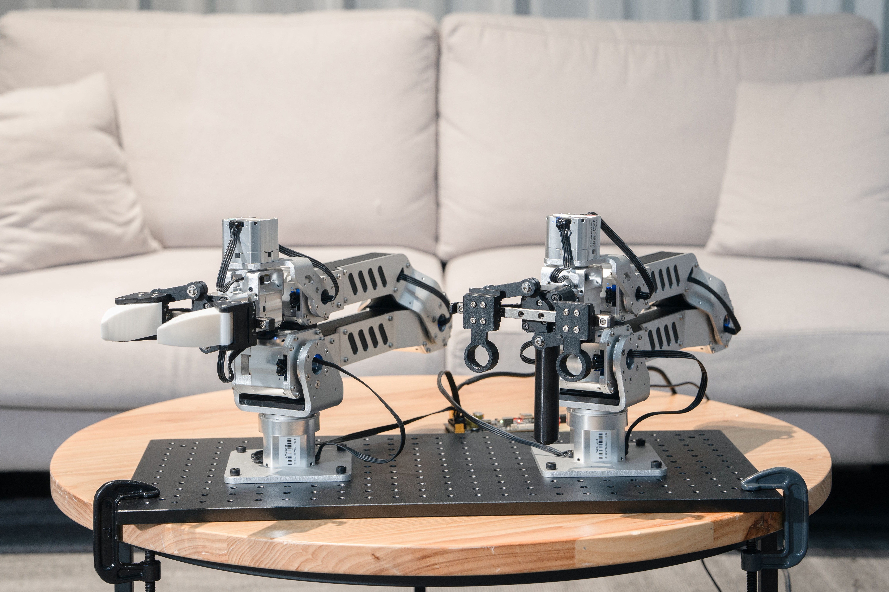

# Panthera-HT 🌟

  

An open-source six-axis robotic arm based on HighTorque joint modules.

  

Panthera-Panthera-HT is an open-source six-axis robotic arm that uses high-performance planetary joint modules for its motors. It provides developers with a reusable unified control interface, serving as a standardized hardware and software experimental platform for algorithm verification, course experiments, system integration, and secondary development.

The current control method for the robotic arm is a pure Python script, with some of its features: position/velocity/torque control, impedance control, gravity compensation mode, gravity compensation-friction compensation mode, master-slave teleoperation (dual arms), drag teaching, etc. For more operation scripts, please refer to the SDK documentation.

## 📷 Product close-up

  
  
  
   
  
  
  

## ⚙️ Control example

### Position and Speed Control:

  

### Master-Slave Teleoperation:

  

### Master–Slave Teleoperated Grasping:

  

## 🗃️ Repository

| Repository                                                                        | License        | Description                                                                                     |
| --------------------------------------------------------------------------------- | -------------- | ----------------------------------------------------------------------------------------------- |
| **[Panthera-HT_Main](https://github.com/HighTorque-Robotics/Panthera-HT_Main)**   | [MIT](LICENSE) | Main project repository, including project introduction, repository link, and feature requests. |
| **[Panthera-HT_SDK](https://github.com/HighTorque-Robotics/Panthera-HT_SDK)**     | [MIT](LICENSE) | Python SDK development package, providing quick-start example code and a development toolchain. |
| **[Panthera-HT_ROS2](https://github.com/HighTorque-Robotics/Panthera-HT-ROS2)**   | [MIT](LICENSE) | ROS2 development package providing robotic arm drivers, control, and simulation support.        |
| **[Panthera-HT_Model](https://github.com/HighTorque-Robotics/Panthera-HT_Model)** | [MIT](LICENSE) | SolidWorks original design files and Bill of Materials (BOM).                                   |

## 🔗 Related documents and links
[Parameters](./images/parameters.jpg)

Unboxing video: (Not yet)

Master-slave teleoperation playing table tennis:https://www.bilibili.com/video/BV1KprhBPE26/

Porting LeRobot dataset for imitation learning:https://www.bilibili.com/video/BV1GLi1BqETz/

## ⚠️ Disclaimer ⚠️

> [!NOTE]
> If you build or develop Panthera-HT based on this repository, you will be fully responsible for all physical and mental damages caused to you or others.

