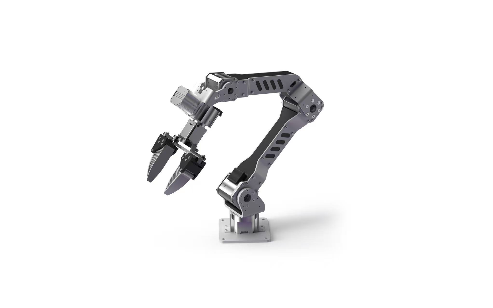
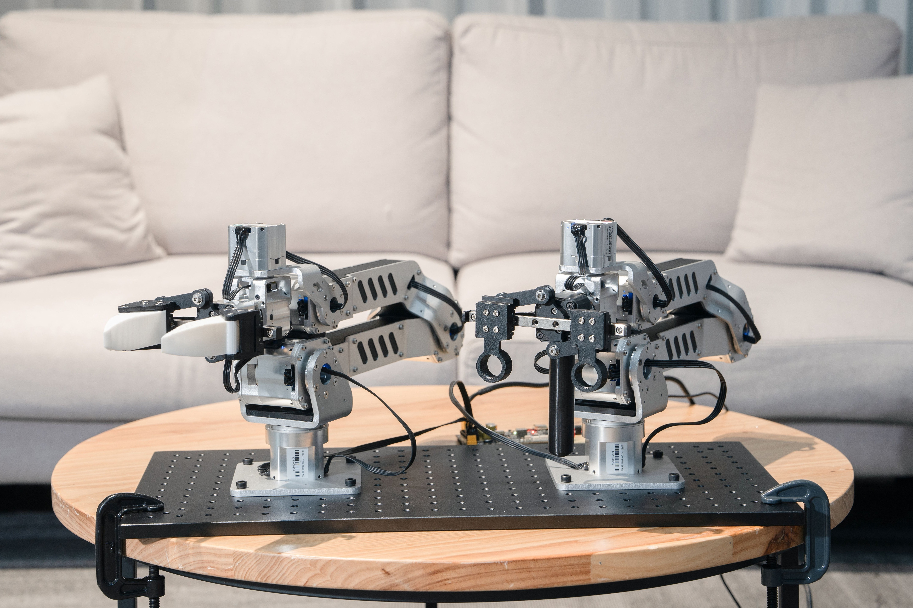
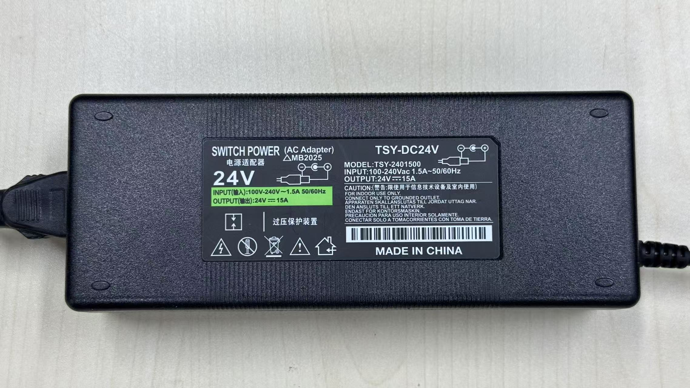

<div align="center">

# Panthera-HT

🌐 **English** | [简体中文](README_zh.md)

*An open-source six-axis robotic arm learning platform for students and makers*



</div>

---

Panthera-HT is an open-source six-axis robotic arm that uses HighTorque planetary joint modules. It provides developers with a reusable unified control interface, serving as a standardized hardware and software experimental platform for algorithm verification, course experiments, system integration, and secondary development.

The current control methods for the robotic arm include C++, Python, and ROS2, with features including: position/velocity/torque control, impedance control, gravity compensation mode, gravity compensation-friction compensation mode, master-slave teleoperation (dual arms), drag teaching, etc. Additionally, it supports data collection and inference under the LeRobot framework. For more operation scripts, please refer to the SDK documentation.

The mission of this project is to **enable students to access high-performance joint motor robotic arms at a lower cost**.

The project originally stems from the open-source work of [Ragtime-LAB/Ragtime_Panthera](https://github.com/Ragtime-LAB/Ragtime_Panthera), which we have refined and optimized. Thanks to the original author [wEch1ng (芝士榴莲肥牛)](https://github.com/wEch1ng) for their selfless sharing and open-source spirit!

To help students learn **how to build and control a robotic arm from scratch (0 to 1)**, we have open-sourced everything from structural design to control algorithms, allowing everyone to deeply understand how robotic arms work.

Later, the original project author and HighTorque hit it off, and with HighTorque's support, the project was refined and brought to market as a more complete maker product. However, we always adhere to the open-source philosophy and impose no restrictions on the project.

### Low Cost + High Performance
- **Sheet Metal Frame**: High cost-performance sheet metal as the main frame, ensuring strength while reducing costs
- **3D Printing + CNC Machining**: Combined with 3D printing and 3-axis CNC machining for flexible structural design
- **High-Performance Joint Modules**: Using HighTorque planetary joint modules, balancing cost and performance

### Fully Open Source + Scalable
- **Open Structure**: Provides SolidWorks original design files, sheet metal unfolding diagrams, 3D printing STL files
- **Open Algorithms**: All code from low-level control to advanced algorithms is fully open source
- **Unrestricted Modification**: You can freely replace motors, modify structures, and change appearance according to your needs
- **Modular Design**: Facilitates secondary development and feature expansion

### Education-Oriented
The core goal of the project is to help students and makers:
- Understand the mechanical structure design of robotic arms
- Learn kinematics and dynamics algorithms
- Master motor control and communication protocols
- Practice the complete process from theory to physical implementation

<div align="center">
  
  
  <br/>
  
  
  <br/>
  
  
</div>

### Position and Speed Control:
<div align="center">
  
</div>

### Master-Slave Teleoperation:
<div align="center">
  
</div>

### Master-Slave Teleoperated Grasping:
<div align="center">
  
</div>

## 📦 Related Repositories

| Repository | License | Description |
| --- | --- | --- |
| **[Panthera-HT_Main](https://github.com/HighTorque-Robotics/Panthera-HT_Main)** | [MIT](LICENSE) | Main project repository, including project introduction, repository links, and feature requests. |
| **[Panthera-HT_Model](https://github.com/HighTorque-Robotics/Panthera-HT_Model)** | [MIT](LICENSE) | SolidWorks original design files, sheet metal unfolding diagrams, 3D printing files, and Bill of Materials (BOM). |
| **[Panthera-HT_SDK](https://github.com/HighTorque-Robotics/Panthera-HT_SDK)** | [MIT](LICENSE) | Python SDK development package, providing quick-start example code and development toolchain. |
| **[Panthera-HT_ROS2](https://github.com/HighTorque-Robotics/Panthera-HT-ROS2)** | [MIT](LICENSE) | ROS2 development package providing robotic arm drivers, control, and simulation support. |
| **[Panthera-HT_lerobot](https://github.com/HighTorque-Robotics/Panthera-HT_lerobot)** | [MIT](LICENSE) | LeRobot integration package, supporting imitation learning and robot learning algorithms. |

## 🚀 Getting Started

### Hardware Preparation
1. Check the [Panthera-HT_Model](https://github.com/HighTorque-Robotics/Panthera-HT_Model) repository for the complete Bill of Materials (BOM)
2. Prepare files for sheet metal processing, 3D printing, and CNC machining
3. Purchase HighTorque joint modules and other electronic components
4. Regarding the selection of power supply devices, we recommend using an adjustable power supply to provide stable 24V 15A power to the device.

- Sets purchased through our sales channels will include a 220V to 24V 15A power adapter (three-prong plug). If the power supply voltage in your region is 220V, you can directly use this adapter.
<div align="center">
  
</div>

### Software Environment
1. Clone the SDK repository:
```bash
git clone https://github.com/HighTorque-Robotics/Panthera-HT_SDK.git
cd Panthera-HT_SDK
```

2. Install dependencies and run example programs (see SDK repository README for details)

### First Example
Refer to the example code in [Panthera-HT_SDK](https://github.com/HighTorque-Robotics/Panthera-HT_SDK) to quickly get started with robotic arm control.

## 🤝 Contributing

This project belongs to everyone who loves robotics!

### Fully Open
- ✅ **Motor Selection**: Can be replaced with joint modules from other brands
- ✅ **Structural Modification**: Can change size, materials, and appearance according to needs
- ✅ **Algorithm Optimization**: Welcome to submit better control algorithms and features
- ✅ **Feature Extension**: Add new features like vision, force control, AI, etc.

### We Need You
The project may not be perfect in many small details, and we need the community's help to improve it together:

- 📝 Improve documentation and tutorials
- 🐛 Report and fix bugs
- 💡 Propose new feature suggestions
- 🔧 Optimize structural design
- 📊 Share your use cases

Welcome to submit Issues and Pull Requests!

## 👥 Contributors
<a href="https://github.com/wEch1ng">
  
</a>
<a href="https://github.com/chizhayuehaiyvyvmao">
  
</a>
<a href="https://github.com/tankail">
  
</a>

## 🔗 Related Documents and Links
- [Quick Start Guide](./documents/Panthera-HT_Quick_Start_Guide_A5.pdf)
- [Parameter Manual](./documents/Panthera-HT_Parameter_Manual_A5.pdf)
- [Robotic Arm Parameters](./images/parameters.jpg)

**Video Demonstrations**:
- Master-slave teleoperation playing table tennis: https://www.bilibili.com/video/BV1KprhBPE26/
- Porting LeRobot dataset for imitation learning: https://www.bilibili.com/video/BV1GLi1BqETz/
- GraspNet grasp pose estimation: https://www.bilibili.com/video/BV13KcDzLE3F/
- Visual tracking color blocks: https://www.bilibili.com/video/BV1JQPfz4EPN

**Community**:
- QQ Group: Panthera-HT Community (1035440629)

**Related Projects**:
- Gripper Design Reference: [UMI (Universal Manipulation Interface)](https://github.com/real-stanford/universal_manipulation_interface)

## 🚀 Future Roadmap
We will continue to develop in two directions:

### Advanced Traditional Control
- Visual servoing control
- Grasping using GraspNet
- Point cloud obstacle avoidance
- More traditional control algorithms

### Embodied Intelligence
- Integration of cutting-edge algorithms like Pi0, Pi0.5
- RoboTWin2.0 adaptation
- End-to-end learning
- Multimodal perception and control

## ⭐ Star History
<a href="https://www.star-history.com/?repos=HighTorque-Robotics%2FPanthera-HT_Main&type=date&legend=top-left">
 <picture>
   <source media="(prefers-color-scheme: dark)" srcset="https://api.star-history.com/image?repos=HighTorque-Robotics/Panthera-HT_Main&type=date&theme=dark&legend=top-left" />
   <source media="(prefers-color-scheme: light)" srcset="https://api.star-history.com/image?repos=HighTorque-Robotics/Panthera-HT_Main&type=date&legend=top-left" />
   
 </picture>
</a>

## ⚠️ Disclaimer
> [!NOTE]
> If you build or develop Panthera-HT based on this repository, you will be fully responsible for all physical and mental damages caused to you or others.
