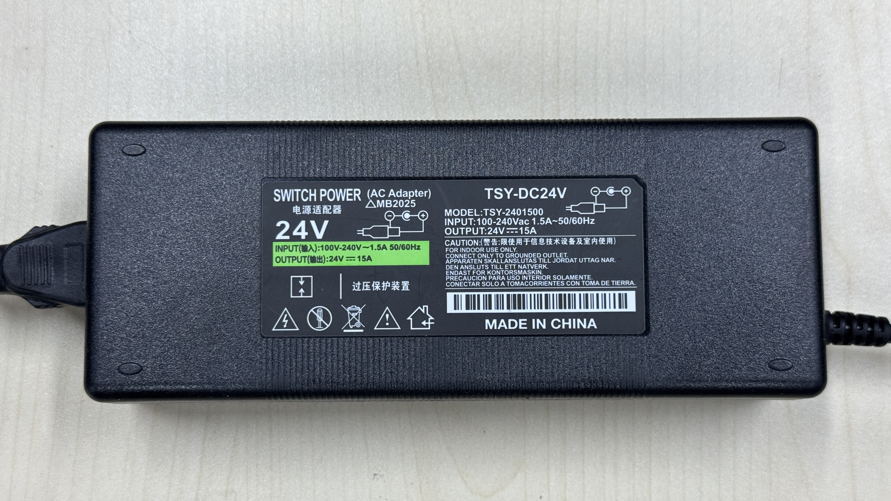
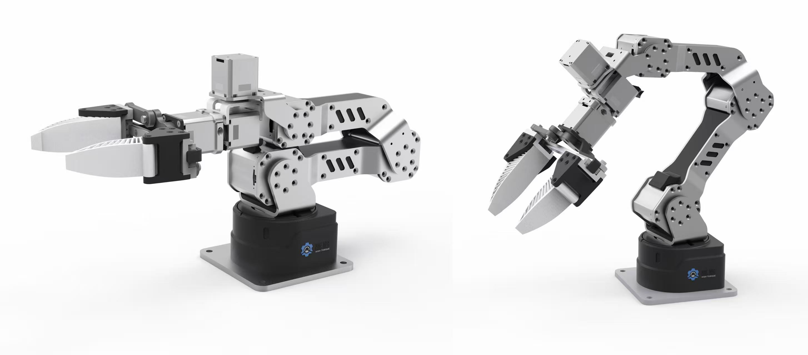

# 🐆 Panthera-HT 开源六轴机械臂

<p align="center">
  
</p>

<p align="center">
  <strong>面向学生、创客、教学实验和机器人学习开发的全开源六轴机械臂平台</strong>
</p>

<p align="center">
    <a href="./LICENSE">
    
    </a>
    
    
    
    
</p>

<table align="center">
  <tr>
    <td align="center">
      <a href="https://www.bilibili.com/video/BV1K9dbBNEdC/?spm_id_from=333.337.search-card.all.click">
        
      </a>
    </td>
    <td align="center">
      <a href="https://www.bilibili.com/video/BV1K9dbBNEdC/?spm_id_from=333.337.search-card.all.click">
        Panthera-HT发布
      </a>
    </td>
  </tr>
</table>

<p align="center">
  <strong>
    <a href="./README.md">简体中文</a> &nbsp;|&nbsp;
    <a href="./README_en.md">English</a>
  </strong>
</p>

<p align="center">
  <a href="https://hightorque.cn/Panthera-HT_Hub/">
    
  </a>
  <a href="https://alidocs.dingtalk.com/i/nodes/ydxXB52LJq19j0OkUMNm3GO4JqjMp697">
    
  </a>
</p>

<table align="center" border="1" bordercolor="#F0B35A" cellpadding="18" cellspacing="0">
  <tr>
    <td align="center" width="360" bgcolor="#FFF8F0">
      <a href="https://www.hightorque.cn/product#term-42-list" target="_blank" rel="noopener noreferrer" title="进入 Panthera-HT 官方商城">
        <big><strong>🛒 点击购买 Panthera-HT</strong></big>
      </a>
    </td>
  </tr>
</table>

---

## 📖 项目简介

Panthera-HT 是一款开源六轴机械臂，使用高擎动力的行星关节模组。我们面向开发者提供可复用的统一控制接口，用于算法验证、课程实验、系统集成、具身智能数据采集及二次开发的标准化软硬件实验平台。

机械臂现有的控制方式包括 C++、Python 和 ROS2，拥有的一些功能：位置/速度/力矩控制、阻抗控制、重力补偿模式、重力补偿-摩擦力补偿模式、主从遥操（双臂）、拖动示教等。此外，还支持在 LeRobot 框架下进行数据采集和推理，在 RoboTwin 下进行仿真数据采集。最新开发 Demo 已覆盖视觉伺服、GraspNet 抓取位姿估计、视觉跟踪色块等方向，更多运行脚本请参考 SDK 文档。

## ✨ 项目起源与初心

这个项目的初心是**让学生党能以更低的价格玩到更高性能的关节电机机械臂**。

项目最初源自 [Ragtime-LAB/Ragtime_Panthera](https://github.com/Ragtime-LAB/Ragtime_Panthera) 的开源工作，我们在此基础上进行了完善和优化。感谢原作者 [wEch1ng(芝士榴莲肥牛)](https://github.com/wEch1ng) 的无私分享和开源精神！

为了方便学生学习**如何从0到1搭建和控制机械臂**，我们将从结构设计到控制算法统统开源，让每个人都能深入理解机械臂的工作原理。

后来项目原作者与高擎一拍即合，在高擎的支持下将项目完善落地，做成了一个更加完善的创客产品。但我们始终坚持开源理念，不对项目作出任何限制。

## 💡 设计理念

### 低成本 + 高性能

- **钣金框架**：选择高性价比的钣金作为整体框架，保证强度的同时降低成本
- **3D打印 + CNC加工**：配合3D打印和三轴CNC加工，实现灵活的结构设计
- **高性能关节模组**：使用高擎动力的行星关节模组，在成本和性能间取得平衡

### 完全开源 + 可扩展

- **结构开源**：提供 SolidWorks 原始设计文件、钣金展开图、3D 打印 STL 文件
- **算法开源**：从底层控制到高级算法，所有代码完全开源
- **无限制修改**：你可以根据需求自由更换电机、修改结构、改变外观
- **模块化设计**：方便进行二次开发和功能扩展

## 📷 项目图片

<div align="center">
  
  
  <br/>
  
  
  <br/>
  
  
</div>

## ⚙️ 控制示例

### 位置速度控制：
<div align="center">
  
</div>

### 主从遥操：
<div align="center">
  
</div>

## 🧭 能力状态

| 方向       | 已支持                                 |
| ---------- | -------------------------------------- |
| 基础控制   | 位置控制、速度控制、力矩控制、阻抗控制 |
| 补偿控制   | 重力补偿、重力补偿-摩擦力补偿          |
| 遥操作     | 双臂主从遥操、拖动示教                 |
| 视觉能力   | 视觉伺服、色块视觉跟踪                 |
| 抓取能力   | GraspNet 抓取位姿估计 Demo             |
| 机器人学习 | LeRobot 数据采集与推理                 |
| ROS2 生态  | 驱动、控制与仿真支持                   |
| RoboTwin2.0 生态  | Panthera单双臂仿真采集                   |

## 🎯 适合的应用场景

- **高校课程实验**：用于运动学、动力学、电机控制、通信协议、ROS2、机器人感知等课程教学。
- **机器人社团与创客项目**：以较低门槛完成机械臂结构搭建、控制调试和 Demo 展示。
- **从理论到实物的完整实践**：帮助学生和创客理解机械结构设计、控制算法和真实硬件调试流程。
- **黑客松快速开发**：快速组合机械臂、相机、夹爪和算法模块，完成短周期项目验证。
- **视觉抓取算法验证**：用于视觉伺服、GraspNet 抓取位姿估计、色块跟踪、点云处理等实验。
- **具身智能数据采集**：结合主从遥操、拖动示教和 LeRobot，采集模仿学习数据。
- **ROS2 控制与仿真教学**：用于驱动开发、控制链路、仿真环境和系统集成训练。
- **RoboTwin2.0仿真采集**：用Panthera在随机化场景进行单双臂的任务采集获取丰富的仿真数据。

## 🗃️开发仓库

| 描述 | 仓库 | 详细说明 |
| --- | --- | --- |
| Python/C++ SDK | **[Panthera-HT_SDK](https://github.com/HighTorque-Robotics/Panthera-HT_SDK)** | 提供快速上手的示例代码、控制接口与完整开发工具链。 |
| Web 上位机 | **[Panthera-HT_Host](https://github.com/HighTorque-Robotics/Panthera-HT_Host)** | 支持机械臂可视化控制，并集成多种 SDK 使用示例。 |
| ROS2 适配仓库 | **[Panthera-HT_ROS2](https://github.com/HighTorque-Robotics/Panthera-HT-ROS2)** | 支持机械臂驱动、控制及仿真环境下的系统集成。 |
| LeRobot 适配仓库 | **[Panthera-HT_lerobot](https://github.com/HighTorque-Robotics/Panthera-HT_lerobot)** | 面向模仿学习与机器人学习任务，提供完整集成支持。 |
| 机械臂模型文件 | **[Panthera-HT_Model](https://github.com/HighTorque-Robotics/Panthera-HT_Model)** | 包含 SolidWorks 源文件、3D 打印文件及物料清单（BOM）。 |
| 开发案例扩展 | **[Panthera-HT_Extensions](https://github.com/HighTorque-Robotics/Panthera_HT_SDK_Extensions)** | 涵盖 D405 相机手眼标定、视觉伺服等流程的实现案例。 |
| RoboTwin2.0 适配仓库 | **[Panthera-HT_RoboTwin](https://github.com/HighTorque-Robotics/Panthera-HT_RoboTwin)** | 支持使用 Panthera-HT 进行 RoboTwin2.0 单双臂仿真数据采集。 |

## 🚀 快速开始

### 开箱搭建

按照[快速使用指南](./documents/Panthera-HT快速使用指南A5.pdf)的说明搭建机械臂，并查看[参数手册](./documents/Panthera-HT参数手册A5.pdf)以了解机械臂的基本参数信息。

### 硬件准备（自行组装可选步骤）

1. 查看 [Panthera-HT_Model](https://github.com/HighTorque-Robotics/Panthera-HT_Model) 仓库了解完整的物料清单（BOM）。
2. 准备钣金加工、3D 打印和 CNC 加工的文件。
3. 采购高擎动力的关节模组和其他电子元件。
4. 关于供电器件的选择，我们建议使用可调电源为设备提供 24V 15A 稳定供电。

- 通过我们的销售渠道购买的套装将包括一个 220V 转 24V 15A 的电源适配器（三线插头）。若您所在地区的供电电压为 220V，您可以直接使用该适配器。
<div align="center">
  
</div>

### 软件环境

1. 克隆 SDK 仓库：
```bash
git clone https://github.com/HighTorque-Robotics/Panthera-HT_SDK.git
cd Panthera-HT_SDK
```

2. 安装依赖并运行示例程序（详见 SDK 仓库的 README）。

### 第一个示例

参考 [Panthera-HT_SDK](https://github.com/HighTorque-Robotics/Panthera-HT_SDK) 中的示例代码，快速上手机械臂控制。

## 🤝 社区贡献

这个项目属于每一个热爱机器人的人！

### 完全开放

- ✅ **电机选择**：可以更换为其他品牌的关节模组
- ✅ **结构修改**：可以根据需求改变尺寸、材料、外观
- ✅ **算法优化**：欢迎提交更好的控制算法和功能
- ✅ **功能扩展**：添加视觉、力控、AI等新功能

### 我们需要你

项目在很多小细节上可能做得不够完善，我们需要社区的力量一起来完善：

- 📝 完善文档和教程
- 🐛 报告和修复bug
- 💡 提出新的功能建议
- 🔧 优化结构设计
- 📊 分享你的使用案例

欢迎提交 Issue 和 Pull Request！

## 🔗 相关文档与链接

### 官方资源

- [Panthera-HT 官方网站](https://hightorque.cn/Panthera-HT_Hub/)
- [产品资料库](https://alidocs.dingtalk.com/i/nodes/ydxXB52LJq19j0OkUMNm3GO4JqjMp697)
- [参数表](images/参数.jpg)

### 视频教程、开发案例与数据采集

- [SDK 快速上手教学](https://www.bilibili.com/video/BV1SxwYzhEai/)
- [开发案例合集](https://www.bilibili.com/video/BV13KcDzLE3F/)
- [RoboTwin 仿真数据采集](https://www.bilibili.com/video/BV1zY8X6xEmD/)

### 社区交流与相关项目

- QQ 群：Panthera-HT 交流群（1035440629）
- [夹爪设计参考：UMI（Universal Manipulation Interface）](https://github.com/real-stanford/universal_manipulation_interface)

<!-- ## 其他型号

### Panthera-HT_S 六轴机械臂

Panthera-HT_S 是 Panthera-HT 的 Mini 型号，在整体尺寸和性能上做了调整，但是夹爪尺寸是一样的。

<div align="center">
  
</div>

SDK仓库：https://github.com/HighTorque-Robotics/Panthera-HT_S_SDK

参数表：[Panthera-HT_S参数](images/S参数.jpg)

| 参数对比 | Panthera-HT | Panthera-HT_S |
| --- | ---: | ---: |
| 质量 | 4.35 kg | 3 kg |
| 臂展 | 860 mm | 641 mm |
| 折叠尺寸 | 460 mm | 410 mm |
| 最大负载 | 3.5 kg | 2.85 kg |
| 最大关节扭矩（峰值） | 36 Nm | 21 Nm | -->

## 🚀 未来规划

我们将持续完善当前能力，并继续扩展更多高级控制和具身智能方向的 Demo：

### 高级传统控制
- 点云避障
- 更多视觉伺服任务
- 更多传统控制算法
- 抓取成功率评估与实验流程标准化

### 具身智能方向
- Pi0、Pi0.5 等前沿算法集成
- 端到端学习
- 多模态感知与控制

## 👥 项目贡献者

<a href="https://github.com/wEch1ng">
  
</a>
<a href="https://github.com/chizhayuehaiyvyvmao">
  
</a>
<a href="https://github.com/tankail">
  
</a>
<a href="https://github.com/CherrySama">
  
</a>
<a href="https://github.com/ky771254">
  
</a>

## ⚠️ 免责声明

> [!NOTE]
> 如果您基于此仓库构建或开发 Panthera-HT，您将对其对您或他人造成的所有身体和精神损害承担全部责任。
