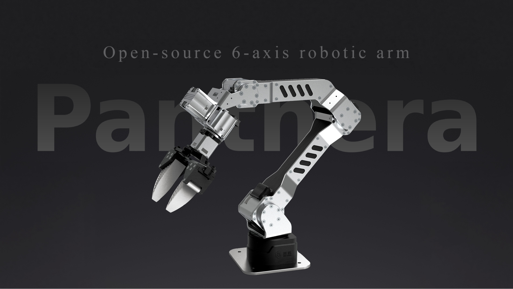

# 🐆 Panthera-HT Open-Source Six-Axis Robotic Arm

<p align="center">
  
</p>

<p align="center">
  <strong>An fully open-source six-axis robotic arm platform for students, makers, education and robot learning development.</strong>
</p>

<p align="center">
    <a href="./LICENSE">
    
    </a>
    
    
    
    
</p>

<table align="center">
  <tr>
    <td align="center">
      <a href="https://www.youtube.com/watch?v=HogcP1ZqEHs">
        
      </a>
    </td>
    <td align="center">
      <a href="https://www.youtube.com/watch?v=HogcP1ZqEHs">
        About Panthera-HT
      </a>
    </td>
  </tr>
</table>

<p align="center">
  <strong>
    <a href="./README.md">简体中文</a> &nbsp;|&nbsp;
    <a href="./README_en.md">English</a>
  </strong>
</p>

<p align="center">
  <a href="https://hightorque.cn/Panthera-HT_Hub/index_en.html">
    
  </a>
  <a href="https://alidocs.dingtalk.com/i/nodes/gwva2dxOW4zEmDq5FkeerMdwJbkz3BRL">
    
  </a>
</p>

<table align="center" border="1" bordercolor="#F0B35A" cellpadding="18" cellspacing="0">
  <tr>
    <td align="center" width="360" bgcolor="#FFF8F0">
      <a href="https://store.hightorque.cn/products/panthera-ht-6-dof-robotic-arm" target="_blank" rel="noopener noreferrer" title="Open the Panthera-HT official store">
        <big><strong>🛒 Buy Panthera-HT</strong></big>
      </a>
    </td>
  </tr>
</table>

---

## 📖 Project Overview

Panthera-HT is an open-source six-axis robotic arm that uses HighTorque planetary joint modules. It provides developers with a reusable unified control interface, serving as a standardized hardware and software experimental platform for algorithm verification, course experiments, system integration, embodied AI data collection, and secondary development.

The current control methods include C++, Python, and ROS2, with features including position/velocity/torque control, impedance control, gravity compensation mode, gravity-friction compensation mode, master-slave teleoperation, drag teaching, and more. It also supports data collection and inference under the LeRobot framework, simulation data collection  by using RoboTwin. Recent development demos include visual servoing, GraspNet grasp pose estimation, and color-block visual tracking. For more operation scripts, please refer to the SDK documentation.

## ✨ Project Origin and Mission

The mission of this project is to **enable students to access high-performance joint motor robotic arms at a lower cost**.

The project originally stems from the open-source work of [Ragtime-LAB/Ragtime_Panthera](https://github.com/Ragtime-LAB/Ragtime_Panthera), which we have refined and optimized. Thanks to the original author [wEch1ng (芝士榴莲肥牛)](https://github.com/wEch1ng) for their selfless sharing and open-source spirit!

To help students learn **how to build and control a robotic arm from scratch (0 to 1)**, we have open-sourced everything from structural design to control algorithms, allowing everyone to deeply understand how robotic arms work.

Later, the original project author and HighTorque hit it off, and with HighTorque's support, the project was refined and brought to market as a more complete maker product. However, we always adhere to the open-source philosophy and impose no restrictions on the project.

## 💡 Design Philosophy

### Low Cost + High Performance

- **Sheet Metal Frame**: High cost-performance sheet metal as the main frame, ensuring strength while reducing costs
- **3D Printing + CNC Machining**: Combined with 3D printing and 3-axis CNC machining for flexible structural design
- **High-Performance Joint Modules**: Using HighTorque planetary joint modules, balancing cost and performance

### Fully Open Source + Scalable

- **Open Structure**: Provides SolidWorks original design files, sheet metal unfolding diagrams, and 3D printing STL files
- **Open Algorithms**: All code from low-level control to advanced algorithms is fully open source
- **Unrestricted Modification**: You can freely replace motors, modify structures, and change appearance according to your needs
- **Modular Design**: Facilitates secondary development and feature expansion

## 📷 Project Images

<div align="center">
  
  
  <br/>
  
  
  <br/>
  
  
</div>

## ⚙️ Control Examples

### Position and Speed Control:
<div align="center">
  
</div>

### Master-Slave Teleoperation:
<div align="center">
  
</div>

## 🧭 Capability Status

| Direction            | Supported                                              |
| -------------------- | ------------------------------------------------------ |
| Basic Control        | Position, velocity, torque, and impedance control      |
| Compensation Control | Gravity compensation and gravity-friction compensation |
| Teleoperation        | Dual-arm master-slave teleoperation and drag teaching  |
| Vision               | Visual servoing and color-block tracking               |
| Grasping             | GraspNet grasp pose estimation demo                    |
| Robot Learning       | LeRobot data collection and inference                  |
| ROS2 Ecosystem       | Drivers, control, and simulation support               |
| RoboTwin2.0 Ecosystem       | Panthera Single/Dual Arm Simulation Data Acquisition               |

## 🎯 Use Cases

- **University courses**: Kinematics, dynamics, motor control, communication protocols, ROS2, and robot perception teaching.
- **Robotics clubs and maker projects**: Lower the barrier to building, controlling, and demonstrating a robotic arm.
- **Theory-to-hardware practice**: Help students and makers understand mechanical design, control algorithms, and real hardware debugging workflows.
- **Hackathon development**: Quickly combine arm hardware, cameras, grippers, and algorithms under short development cycles.
- **Vision-based grasping research**: Visual servoing, GraspNet grasp pose estimation, color tracking, and point-cloud experiments.
- **Embodied AI data collection**: Collect imitation learning data with teleoperation, drag teaching, and LeRobot.
- **ROS2 control and simulation training**: Driver development, control pipelines, simulation, and system integration.
- **RoboTwin 2.0 Simulation Data Acquisition**: Using Panthera to perform single and dual-arm task acquisition in randomized scenarios to obtain rich simulation data.

## 🗃️ Development Repositories

| Description | Repository | Details |
| --- | --- | --- |
| Python/C++ SDK | **[Panthera-HT_SDK](https://github.com/HighTorque-Robotics/Panthera-HT_SDK)** | Provides quick-start examples, control interfaces, and a complete development toolchain. |
| Web host application | **[Panthera-HT_Host](https://github.com/HighTorque-Robotics/Panthera-HT_Host)** | Supports visual robotic-arm control and integrates multiple SDK usage examples. |
| ROS2 adaptation | **[Panthera-HT_ROS2](https://github.com/HighTorque-Robotics/Panthera-HT-ROS2)** | Supports robotic-arm drivers, control, and system integration in simulation environments. |
| LeRobot adaptation | **[Panthera-HT_lerobot](https://github.com/HighTorque-Robotics/Panthera-HT_lerobot)** | Provides integrated support for imitation learning and robot learning tasks. |
| Robotic-arm model files | **[Panthera-HT_Model](https://github.com/HighTorque-Robotics/Panthera-HT_Model)** | Contains SolidWorks source files, 3D-printing files, and the bill of materials (BOM). |
| Development extensions | **[Panthera-HT_Extensions](https://github.com/HighTorque-Robotics/Panthera_HT_SDK_Extensions)** | Includes implementation examples for D405 camera hand-eye calibration, visual servoing, and more. |
| RoboTwin 2.0 adaptation | **[Panthera-HT_RoboTwin](https://github.com/HighTorque-Robotics/Panthera-HT_RoboTwin)** | Supports single- and dual-arm simulation data collection with Panthera-HT in RoboTwin 2.0. |

## 🚀 Quick Start

### Unboxing and Setup

Follow the [Quick Start Guide](./documents/Panthera-HT_Quick_Start_Guide_A5.pdf) to assemble the robotic arm, and consult the [Parameter Manual](./documents/Panthera-HT_Parameter_Manual_A5.pdf) for its basic specifications.

### Hardware Preparation (Optional for Self-Assembly)

1. Check the [Panthera-HT_Model](https://github.com/HighTorque-Robotics/Panthera-HT_Model) repository to review the complete Bill of Materials (BOM).
2. Prepare files for sheet metal processing, 3D printing, and CNC machining.
3. Purchase HighTorque joint modules and other electronic components.
4. Regarding the selection of power supply devices, we recommend using an adjustable power supply to provide stable 24V 15A power to the device.

- Sets purchased through our sales channels will include a 220V to 24V 15A power adapter (three-prong plug). If the power supply voltage in your region is 220V, you can directly use this adapter.
<div align="center">
  
</div>

### Software Environment

1. Clone the SDK repository:
```bash
git clone https://github.com/HighTorque-Robotics/Panthera-HT_SDK.git
cd Panthera-HT_SDK
```

2. Install dependencies and run example programs (see SDK repository README for details).

### First Example

Refer to the example code in [Panthera-HT_SDK](https://github.com/HighTorque-Robotics/Panthera-HT_SDK) to quickly get started with robotic arm control.

## 🤝 Community Contribution

This project belongs to everyone who loves robotics!

### Fully Open

- ✅ **Motor Selection**: Can be replaced with joint modules from other brands
- ✅ **Structural Modification**: Can change size, materials, and appearance according to needs
- ✅ **Algorithm Optimization**: Welcome to submit better control algorithms and features
- ✅ **Feature Extension**: Add new features like vision, force control, AI, etc.

### We Need You

The project may not be perfect in many small details, and we need the community's help to improve it together:

- 📝 Improve documentation and tutorials
- 🐛 Report and fix bugs
- 💡 Propose new feature suggestions
- 🔧 Optimize structural design
- 📊 Share your use cases

Welcome to submit Issues and Pull Requests!

## 🔗 Related Documents and Links

### Official Resources

- [Panthera-HT Official Website](https://hightorque.cn/Panthera-HT_Hub/)
- [Documentation Database](https://alidocs.dingtalk.com/i/nodes/ydxXB52LJq19j0OkUMNm3GO4JqjMp697)
- [Parameter Table](images/parameter.jpg)

### Tutorials, Development Cases, and Data Collection

- [SDK Quick Start Tutorial](https://www.bilibili.com/video/BV1SxwYzhEai/)
- [Development Case Collection](https://www.bilibili.com/video/BV13KcDzLE3F/)
- [RoboTwin Simulation Data Collection](https://www.bilibili.com/video/BV1zY8X6xEmD/)

### Community and Related Projects

- QQ Group: Panthera-HT Community (1035440629)
- [Gripper Design Reference: UMI (Universal Manipulation Interface)](https://github.com/real-stanford/universal_manipulation_interface)

<!-- ## Other Models

### Panthera-HT_S 6-DOF Robotic Arm

Panthera-HT_S is the Mini model of Panthera-HT, with adjustments made to overall size and performance, but the gripper size remains the same.

<div align="center">
  
</div>

SDK repository: https://github.com/HighTorque-Robotics/Panthera-HT_S_SDK

| Parameter comparison | Panthera-HT | Panthera-HT_S |
| --- | ---: | ---: |
| Mass | 4.35 kg | 3 kg |
| Arm span | 860 mm | 641 mm |
| Folded dimensions | 460 mm | 410 mm |
| Maximum payload | 3.5 kg | 2.85 kg |
| Maximum joint torque (peak) | 36 Nm | 21 Nm | -->

## 🚀 Future Roadmap

We will continue improving the current capabilities and expanding more demos for advanced control and embodied intelligence:

### Advanced Traditional Control
- Point-cloud obstacle avoidance
- More visual servoing tasks
- More traditional control algorithms
- Grasp success evaluation and standardized experiment workflows

### Embodied Intelligence
- Integration of cutting-edge algorithms like Pi0, Pi0.5
- End-to-end learning
- Multimodal perception and control

## 👥 Project Contributors

<a href="https://github.com/wEch1ng">
  
</a>
<a href="https://github.com/chizhayuehaiyvyvmao">
  
</a>
<a href="https://github.com/tankail">
  
</a>
<a href="https://github.com/CherrySama">
  
</a>
<a href="https://github.com/ky771254">
  
</a>

## ⚠️ Disclaimer

> [!NOTE]
> If you build or develop Panthera-HT based on this repository, you will be fully responsible for all physical and mental damages caused to you or others.
