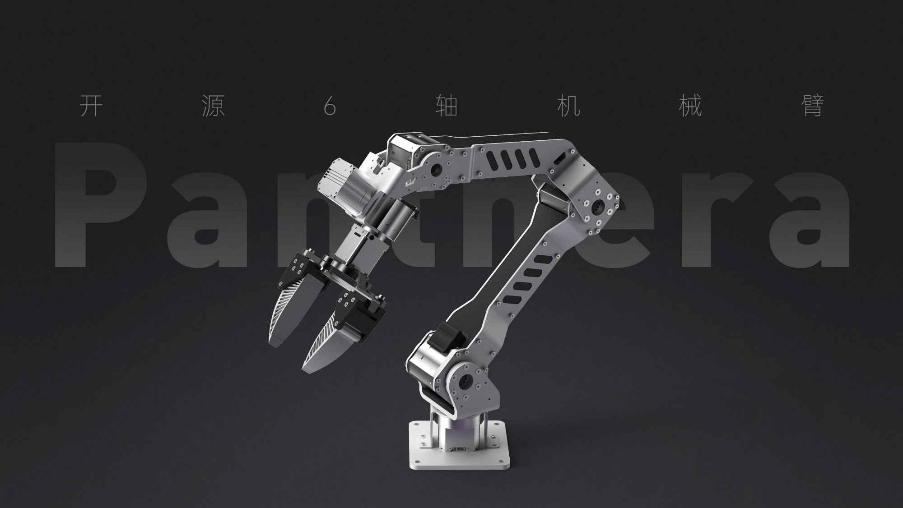

<div align="center">

# Panthera-HT

🌐 [English](README.md) | **简体中文**

*面向学生和创客的开源六轴机械臂学习平台*



</div>

---

Panthera-HT是一款开源六轴机械臂，使用高擎机电的行星关节模组。我们面向开发者提供可复用的统一控制接口，用于算法验证、课程实验、系统集成及二次开发的标准化软硬件实验平台。

机械臂现有的控制方式包括C++、Python和ROS2，拥有的一些功能：位置/速度/力矩控制、阻抗控制、重力补偿模式、重力补偿-摩擦力补偿模式、主从遥操（双臂）、拖动示教等。此外，还支持在LeRobot框架下进行数据采集和推理。更多运行脚本请参考SDK文档。

这个项目的初心是**让学生党能以更低的价格玩到更高性能的关节电机机械臂**。

项目最初源自 [Ragtime-LAB/Ragtime_Panthera](https://github.com/Ragtime-LAB/Ragtime_Panthera) 的开源工作，我们在此基础上进行了完善和优化。感谢原作者 [wEch1ng(芝士榴莲肥牛)](https://github.com/wEch1ng) 的无私分享和开源精神！

为了方便学生学习**如何从0到1搭建和控制机械臂**，我们将从结构设计到控制算法统统开源，让每个人都能深入理解机械臂的工作原理。

后来项目原作者与高擎一拍即合，在高擎的支持下将项目完善落地，做成了一个更加完善的创客产品。但我们始终坚持开源理念，不对项目作出任何限制。

### 低成本 + 高性能
- **钣金框架**：选择高性价比的钣金作为整体框架，保证强度的同时降低成本
- **3D打印 + CNC加工**：配合3D打印和三轴CNC加工，实现灵活的结构设计
- **高性能关节模组**：使用高擎机电的行星关节模组，在成本和性能间取得平衡

### 完全开源 + 可扩展
- **结构开源**：提供SolidWorks原始设计文件、钣金展开图、3D打印STL文件
- **算法开源**：从底层控制到高级算法，所有代码完全开源
- **无限制修改**：你可以根据需求自由更换电机、修改结构、改变外观
- **模块化设计**：方便进行二次开发和功能扩展

### 教育导向
项目的核心目标是帮助学生和创客：
- 理解机械臂的机械结构设计
- 学习运动学和动力学算法
- 掌握电机控制和通信协议
- 实践从理论到实物的完整过程

<div align="center">
  
  
  <br/>
  
  
  <br/>
  
  
</div>

### 位置速度控制：
<div align="center">
  
</div>

### 主从遥操：
<div align="center">
  
</div>

### 主从遥操抓取：
<div align="center">
  
</div>

## 📦 相关仓库

| 仓库 | 许可证 | 描述 |
| --- | --- | --- |
| **[Panthera-HT_Main](https://github.com/HighTorque-Robotics/Panthera-HT_Main)** | [MIT](LICENSE) | 主项目仓库，包含项目介绍、仓库链接和功能请求。 |
| **[Panthera-HT_Model](https://github.com/HighTorque-Robotics/Panthera-HT_Model)** | [MIT](LICENSE) | SolidWorks原始设计文件、钣金图、3D打印文件和物料清单（BOM）。 |
| **[Panthera-HT_SDK](https://github.com/HighTorque-Robotics/Panthera-HT_SDK)** | [MIT](LICENSE) | Python SDK 开发包，提供快速上手的示例代码与开发工具链。 |
| **[Panthera-HT_ROS2](https://github.com/HighTorque-Robotics/Panthera-HT-ROS2)** | [MIT](LICENSE) | ROS2 开发包，提供机械臂的驱动、控制与仿真支持。 |
| **[Panthera-HT_lerobot](https://github.com/HighTorque-Robotics/Panthera-HT_lerobot)** | [MIT](LICENSE) | LeRobot 集成包，支持模仿学习和机器人学习算法。 |

## 🚀 快速开始

### 硬件准备
1. 查看 [Panthera-HT_Model](https://github.com/HighTorque-Robotics/Panthera-HT_Model) 仓库获取完整的物料清单（BOM）
2. 准备钣金加工、3D打印和CNC加工的文件
3. 采购高擎机电的关节模组和其他电子元件
4. 关于供电器件的选择，我们建议使用可调电源为设备提供 24V 15A 稳定供电。

- 通过我们的销售渠道购买的套装将包括一个 220V 转 24V 15A 的电源适配器（三线插头）。若您所在地区的供电电压为220V，您可以直接使用该适配器。
<div align="center">
  
</div>

### 软件环境
1. 克隆SDK仓库：
```bash
git clone https://github.com/HighTorque-Robotics/Panthera-HT_SDK.git
cd Panthera-HT_SDK
```

2. 安装依赖并运行示例程序（详见SDK仓库的README）

### 第一个示例
参考 [Panthera-HT_SDK](https://github.com/HighTorque-Robotics/Panthera-HT_SDK) 中的示例代码，快速上手机械臂控制。

## 🤝 参与贡献

这个项目属于每一个热爱机器人的人！

### 完全开放
- ✅ **电机选择**：可以更换为其他品牌的关节模组
- ✅ **结构修改**：可以根据需求改变尺寸、材料、外观
- ✅ **算法优化**：欢迎提交更好的控制算法和功能
- ✅ **功能扩展**：添加视觉、力控、AI等新功能

### 我们需要你
项目在很多小细节上可能做得不够完善，我们需要社区的力量一起来完善：

- 📝 完善文档和教程
- 🐛 报告和修复bug
- 💡 提出新的功能建议
- 🔧 优化结构设计
- 📊 分享你的使用案例

欢迎提交 Issue 和 Pull Request！

## 👥 贡献者
<a href="https://github.com/wEch1ng">
  
</a>
<a href="https://github.com/chizhayuehaiyvyvmao">
  
</a>
<a href="https://github.com/tankail">
  
</a>

## 🔗 相关文档与链接
- [快速使用指南](./documents/Panthera-HT快速使用指南A5.pdf)
- [参数手册](./documents/Panthera-HT参数手册A5.pdf)
- [机械臂各项参数](./images/参数.jpg)

**演示视频**：
- 主从遥操打乒乓球：https://www.bilibili.com/video/BV1KprhBPE26/
- 移植LeRobot数据集进行模仿学习：https://www.bilibili.com/video/BV1GLi1BqETz/
- GraspNet抓取位姿估计：https://www.bilibili.com/video/BV13KcDzLE3F/
- 视觉跟踪色块：https://www.bilibili.com/video/BV1JQPfz4EPN

**教程视频**：
- SDK配置与上手：https://www.bilibili.com/video/BV1SxwYzhEai/

**交流群**：
- QQ群：Panthera-HT交流群（1035440629）

**相关项目**：
- 夹爪设计参考：[UMI (Universal Manipulation Interface)](https://github.com/real-stanford/universal_manipulation_interface)

## 🚀 未来规划
我们将朝着两个方向持续发展：

### 高级传统控制
- 视觉伺服控制
- 使用 GraspNet 进行抓取
- 点云避障
- 更多传统控制算法

### 具身智能方向
- Pi0、Pi0.5 等前沿算法集成
- RoboTWin2.0 适配
- 端到端学习
- 多模态感知与控制

## ⭐ Star History
<a href="https://www.star-history.com/?repos=HighTorque-Robotics%2FPanthera-HT_Main&type=date&legend=top-left">
 <picture>
   <source media="(prefers-color-scheme: dark)" srcset="https://api.star-history.com/image?repos=HighTorque-Robotics/Panthera-HT_Main&type=date&theme=dark&legend=top-left" />
   <source media="(prefers-color-scheme: light)" srcset="https://api.star-history.com/image?repos=HighTorque-Robotics/Panthera-HT_Main&type=date&legend=top-left" />
   
 </picture>
</a>

## ⚠️ 免责声明
> [!NOTE]
> 如果您基于此仓库构建或开发Panthera-HT，您将对其对您或他人造成的所有身体和精神损害承担全部责任。
